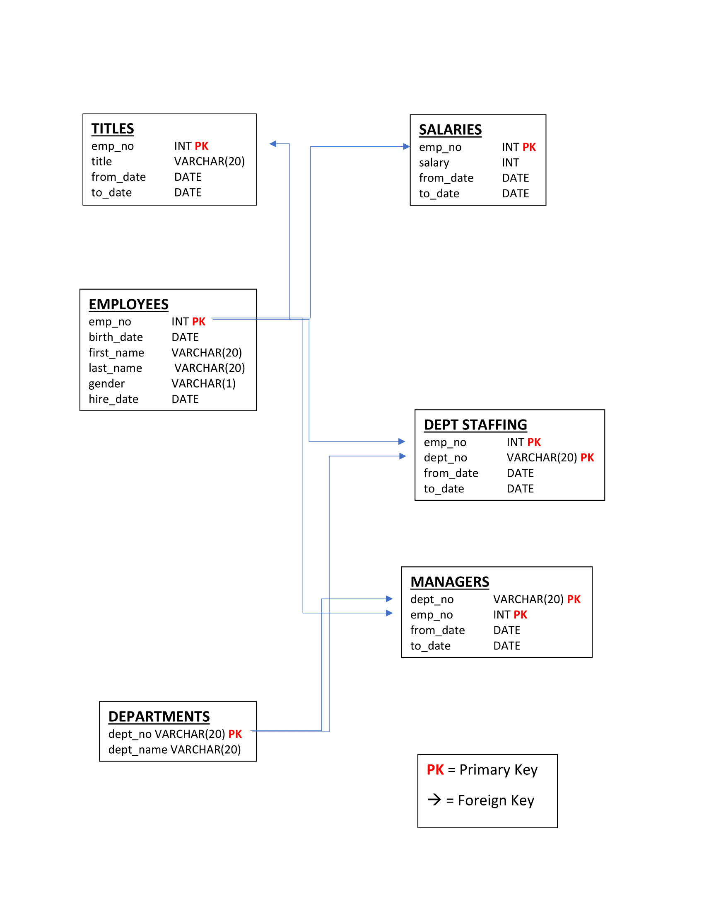

# SQL Test Data

## Background
**This repository houses the data analysis for a fake SQL analysis exercise with the following prompt:**

It is a beautiful spring day, and it is two weeks since you have been hired as a new data engineer at Pewlett Hackard. Your first major task is a research project on employees of the corporation from the 1980s and 1990s. All that remain of the database of employees from that period are six CSV files.

In this assignment, you will design the tables to hold data in the CSVs, import the CSVs into a SQL database, and answer questions about the data. In other words, you will perform:

#### 1) Data Modeling
Inspect the CSVs and sketch out an ERD of the tables.

#### 2) Data Engineering
Use the information you have to create a table schema for each of the six CSV files, specifying data types, primary keys, foreign keys, and other constraints. Import each CSV file into the corresponding SQL table.

#### 3) Data Analysis
Once a complete database is in place, do the following:
1. List the following details of each employee: employee number, last name, first name, gender, and salary.
2. List employees who were hired in 1986.
3. List the manager of each department with the following information: department number, department name, the manager's employee number, last name, first name, and start and end employment dates.
4. List the department of each employee with the following information: employee number, last name, first name, and department name.
5. List all employees whose first name is "Hercules" and last names begin with "B."
6. List all employees in the Sales department, including their employee number, last name, first name, and department name.
7. List all employees in the Sales and Development departments, including their employee number, last name, first name, and department name.
8. In descending order, list the frequency count of employee last names, i.e., how many employees share each last name.
-----

## Iniitial Database Loading
Based on the provided information, I created the following ER Diagram:

SQL analysis conducted accroding to the above prompt is housed in the following files, create in PostgreSQL:
* `PPatel-SQLschema-code.sql`
* `PPatel-SQLanalysis-code.sql`

These files will allow you to create the same database on a local version of Postgres. 

Before running the code, you will need to create a file entitled config.py as follows, access the local Postgres database :
user = "YOUR USERNAME HERE"
password = "YOUR PASSWORD HERE"
